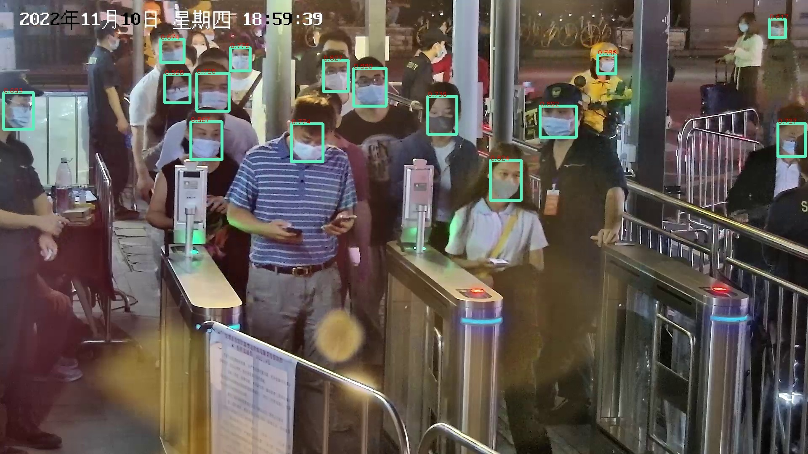
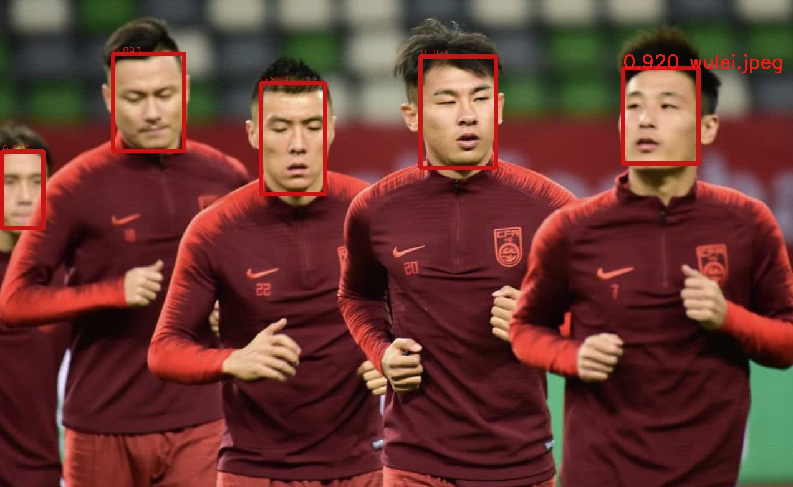
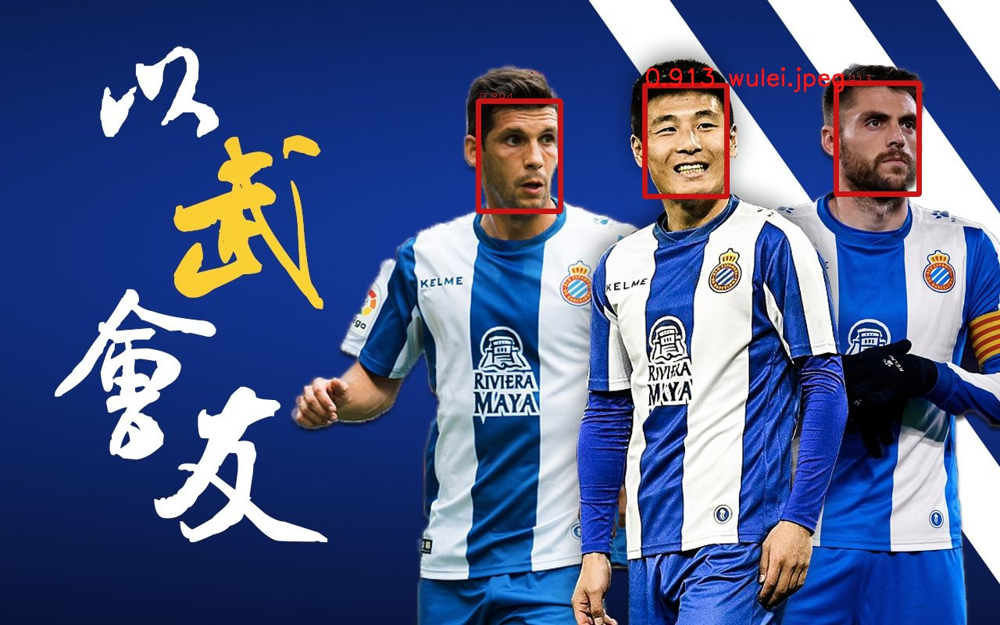
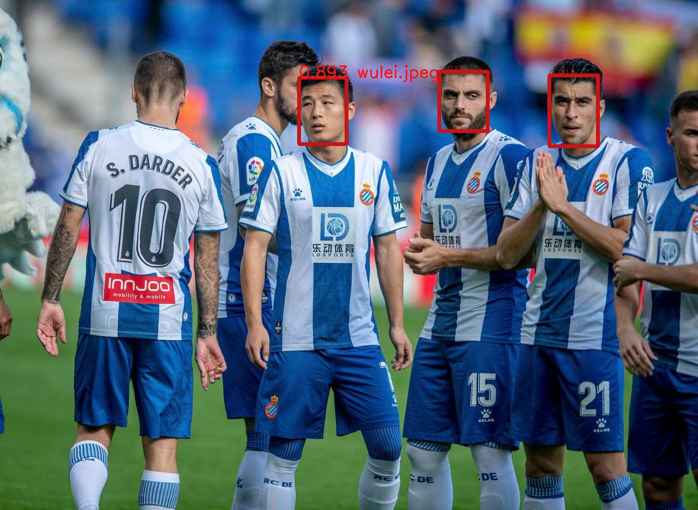
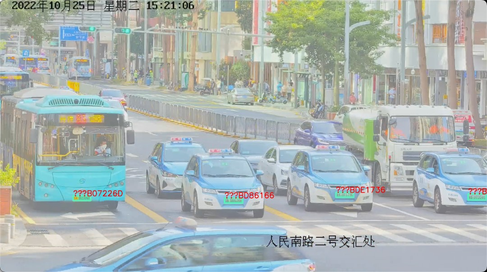

# 人脸识别&车牌识别 SDK 简介

本文说明 人脸&车牌 SDK 的使用。

## 功能简介

### 人脸检测&识别

对于人脸部分，SDK 提供了以下能力：

1. 人脸检测

1.1 人脸是否带口罩判定
1.2 人脸角度检测

以闸口戴口罩检测为例，Demo 结果如下图所示：


(绿色框为正确佩戴口罩，红色框为未佩戴口罩或不正确佩戴口罩）



2. 人脸识别

2.1 1:1 识别
2.2 1:N 识别

我们在底库中加入中国足球运动员武磊的照片，并使用3张包含他的集体照进行人脸识别测试，如下：







3. 用户重识别

待完成

### 车牌检测&识别

对于车牌部分，SDK 提供了以下能力：

1. 车辆检测
2. 车牌检测（蓝牌、绿牌、黄牌[含双层黄牌]、白牌、黑牌等）
3. 车牌识别

以十字路口灯杆拍摄场景为例，Demo 结果如下图所示：



## 目录结构

* SDK 目录结构

SDK 包的内容如下：

```
--- [face_recog_lib_rk]
   +--- Makefile
   +--- face_sdk.cpp / face_sdk.h - 人脸识别 SDK 二次封装，使用该封装即可完成图片的人脸检测、特征提取需求
   +--- face_demo.cpp - 基于二次封装的一个 Demo 程序，实现从 ../data/users 目录读取图片并作为底库，再从 ../data/images 读取图片进行人脸检索的功能，检测结果将以图片形式输出到 ../data/images_result 目录
   +--- plate_sdk.cpp / plate_sdk.h - 车牌识别 SDK 二次封装，配置参数针对街景识别
   +--- plate_demo.cpp - 基于二次封装的一个 Demo 程序，实现从 ../data/plates 目录读取图片进行车牌检索及识别的功能，检测结果将以图片形式输出到 ../data/plates_result 目录
   +--- similarity_transform.cpp
   +--- [include] - 人脸/车牌 SDK 的头文件
   +--- [lib64] - 人脸/车牌 SDK 在 AARCH64 上的动态库
   +--- [3rdparty]
      +--- [include] - 需要引入的第三方头文件
      +--- [lib64] - 编译需要的第三方动态库
```

* Demo 目录结构

Demo 包的内容如下，使用时需放在 7G 盒子中的 `/userdata/` 目录下

```
--- [userdata] - /userdata 系统目录
   +-- [face_app]
      +--- [3rdparty] - 执行 Demo 需要的第三方动态库，因为有些 RK 环境下部署的 Buildroot 版本的本地库有部分缺失，因此需在 LD_LIBRARY_PATH 中指定优先使用本目录下的动态库
      +--- [assets] - 人脸&车牌 SDK 的模型文件
      +--- [data]
         +--- [users] - 如前文 face_demo.cpp 介绍，此目录存放人脸底库图片
         +--- [images] - 人脸检测任务图片
         +--- [images_result] - 人脸检测结果
         +--- [plates] - 车牌识别任务图片
         +--- [plates_result] - 车牌识别结果
      +--- [lib] - 人脸 SDK 的动态库
      +--- [bin] - face_demo 可执行程序
         +--- face_demo_license.key - 跟设备绑定的 License
         +--- face_demo
         +--- run_face_demo.sh - 指定 LD_LIBRARY_PATH 并启动 face_demo 的脚本。进入该目录直接执行该脚本，可快速验证人脸检测&识别的 Demo
         +--- plate_demo
         +--- run_plate_demo.sh - 指定 LD_LIBRARY_PATH 并启动 plate_demo 的脚本。进入该目录直接执行该脚本，可快速验证车牌检测&识别的 Demo

```

## 快速验证

将 `face_demo_{date}.tar` 部署到 IoT 设备中的 `/userdata/` 目录下并解压缩，确认 `/userdata/face_app/bin/face_demo_license.key` 是本设备的 License 文件。

进入 `/userdata/face_app/bin/` 目录下，执行 `sh run_face_demo.sh` 脚本，验证人脸检测和识别功能，输出结果包括屏幕日志，及 `/userdata/face_app/data/images_result/` 目录下的图片。

在同一个目录下，执行 `sh run_plate_demo.sh` 脚本，验证车牌检测和识别功能，输出结果包括屏幕日志，及 `/userdata/face_app/data/plates_result/` 目录下的图片。

## 二次开发

### 编译

解压缩 `face_sdk_{date}.tar` 到任意开发目录。

`./face_recog_lib_rk/face_sdk.h/cpp` 对人脸 SDK 进行了二次封装，抽象了较为简单的接口，可参考 `./face_recog_lib_rk/face_demo.cpp` 文件进行二次开发。

`./face_recog_lib_rk/plate_sdk.h/cpp` 对车牌 SDK 进行了二次封装，抽象了较为简单的接口，可参考 `./face_recog_lib_rk/plate_demo.cpp` 文件进行二次开发。


编译时需使用 `./face_recog_lib_rk/3rdparty/lib64` 下的动态库进行链接，可参考 `./face_recog_lib_rk/Makefile`。

需要注意的是，由于 RKMedia 的 RGA 库的限制，输入图片的长、宽需为4的整数倍，否则 `face_sdk.cpp` 中会先调用 OpenCV 的方法（耗费一定时间）对图片进行对齐。同样因为 RK1808 平台上旧版本 RGA 库的限制，输入图片的长、宽不能超过 2000 像素。

### API 

人脸检测及识别功能封装在 `face_sdk.h` 中，由 `class FaceSDK` 提供，具体 API 如下：


* 初始化人脸 SDK

```
/*
 * @params [license_path] - 传入离线 License 文件地址
 */
explicit FaceSDK(const char* license_path);
```

* 传入待检测图片

为减少 SDK 内部的内存拷贝次数，人俩检测、人脸特征计算 的 API 调用时需按照特定顺序。首先调用 `loadRawImage` 或 `loadEncodedImage` 方法，向 SDK 传入图片；然后使用 `getAllFaces` 方法，获取图片中的所有人脸；再根据该方法的返回值中的人脸质量 `FaceDetectResult::quality`，调用 `getFaceFeature` 方法获取人脸特征值，或调用 `getFaceImage` 方法获取人脸区域图片。

在再次调用 `loadRawImage` 或 `loadEncodedImage` 前，可以重复调用 `getAllFaces`、`getFaceFeature` 或 `getFaceImage` 方法获取人脸及相关信息。

对于 `loadRawImage` 方法，需要注意的是，输入的图片为 **BGR** 格式，即 `OpenCV::imread` 或 `OpenCV::imdecode` 打开图片的默认格式。该方法通过 `face_num` 参数返回图片中的人脸数量。

```
/*
 * 载入图片 
 *
 * @params [bgr_data] - 输入 8bit 位图，色彩模式为 BGR，通道顺序为 HWC 
 * @params [image_width] - 输入图片的 Width
 * @params [image_height] - 输入图片的 Height
 * @params [bigger_face_mode] - True 表示输入为大头照，用于底库建库；False 表示输入为普通照片
 * @params face_num - 图片中人脸的数目
 *
 * @return - 0 表示正常返回，其余为错误
 */
int loadRawImage( 
        const unsigned char* bgr_data,
        size_t image_width,
        size_t image_height,
        bool bigger_face_mode,
        int* face_num);

/*
 * 载入图片 
 *
 * @params [jpg_data] - 输入 JPG/PNG 格式的图片
 * @params [jpg_size] - 输入图片的长度
 * @params [bigger_face_mode] - True 表示输入为大头照，用于底库建库；False 表示输入为普通照片
 * @params face_num - 图片中人脸的数目
 *
 * @return - 0 表示正常返回，其余为错误
 */
int loadEncodedImage( 
        const unsigned char* jpg_data,
        size_t jpg_size,
        bool bigger_face_mode,
        int* face_num);
```

* 获取人脸检测结果

人脸检测及识别功能的返回结果由 `struct FaceDetectResult` 表示，包含以下信息:

```
// 人脸检测返回值
struct FaceDetectResult {
    int bbox[4];        // 人脸的 BBox，[0,1] 为左上角，[2,3] 为右下角
    int face_mask;      // 佩戴口罩的标记，0-佩戴口罩，1-未佩戴口罩
    int quality;        // 人脸质量打分
};
```

SDK 用户根据 `loadRawImage` 或 `loadEncodedImage` 方法中的返回参数 `face_num`，获得人脸数量后，需要创建对应长度的 `FaceDetectResult` 数组，该数组的内存由 SDK 用户在外部自行负责创建或释放。

用户可通过 `getAllFaces` 方法，获得检测的所有人脸。

```
/*
 * 获取载入图片的人脸检测结果
 *
 * @params [face_detects] - 人脸检测结果 FaceDetectResult 数组，空间由外部分
 *                          配，其长度至少应 到 load_image 时返回的 face_num 
 *                          人脸数量
 *
 * @return - >=0 表示正常返回，且返回值为人脸的数目；<0 为错误
 **/
int getAllFaces(
        FaceDetectResult* face_detects);
```

* 人脸特征

用户可以根据 `FaceDetectResult` 结构中的 `quality` 筛选符合质量要求的人脸进行特征提取，人脸质量阈值的建议在后文中描述。

用户使用 `getFaceFeature` 获取人脸特征向量。参数 `face_feature` 为长度为 `512` 的 float 数组，该数组的空间需由用户在自行申请或释放。

```
/*
 * 获取人脸的特征值
 *
 * @params [face_idx] - 人脸检测结果中对应的人脸序号 
 * @params [face_feature] - 人脸特征值数组，长度为 FRS_FEATURE_LENGTH 的 float
 *                          数组，空间由外部分配
 *
 * @return - 0 表示正常返回，其余为错误
 **/
int getFaceFeature(
        int face_idx,
        float* face_feature);
```

用户使用 `faceSimilarity` 方法比对两个人脸的相似度，返回值映射到一个百分制的分数区间中。

```
/*
 * 获取人脸相似度打分
 *
 * @params [face_feature0] - 人脸特征值数组，长度为 FRS_FEATURE_LENGTH 
 * @params [face_feature1] - 人脸特征值数组，长度为 FRS_FEATURE_LENGTH 
 * 
 * @return - 相似度分值，0~100 分
 */
int faceSimilarity(
    const float* face_feature0,
    const float* face_feature1);
```

* 人脸区域图片

用户可调用 `getFaceImage` 获得人脸区域图片。

```
/*
 * 获取经过对齐的人脸图片
 *
 * @params [face_idx] - 人脸检测结果中对应的人脸序号 
 * @params [face_aligned] - 经过对齐的人脸图片
 *
 * @return - 0 表示正常返回，其余为错误
 **/
int getFaceImage(
        int face_idx,
        cv::Mat* face_aligned);
```

### SDK 参数设定

针对不同的业务场景，我们给定了不同的推荐参数。

* 人脸门禁机

我们建议输入的图片或检索 ROI 的像素不低于 `320x320`。

在底库建库时，我们建议根据实际情况，将 `FaceSDK` 初始化时的 `FaceDetectParam` （除默认值外）设为：

```
track_param.face_mask_mode = false;     // false - 无需口罩检测，true - 需口罩检测 
track_param.bigger_face_mode = true;    // false - 检测所有人脸，true - 检测最大的人脸
```

在门禁图片比对时，我们建议根据实际情况，将 `FaceSDK` 初始化时的 `FaceDetectParam` （除默认值外）设为：

```
track_param.face_mask_mode = false;     // false - 无需口罩检测，true - 需口罩检测 
track_param.bigger_face_mode = false;   // false - 检测所有人脸，true - 检测最大的人脸
```

门禁场景中，建议将人脸质量分数的阈值设为 80 分，即 `face_demo.cpp` 中的 `FACE_QUALITY_THRESHOLD` 设为 80。

门禁场景中，比对底库是由正常条件下的人脸身份信息构造的人脸识别场景（含 1:1 和 1:N），对于人脸识别的相似度，我们建议将相似度阈值设为 89 分，即超过 89 分的刷脸行为认为是本人，允许放行，即 `face_demo.cpp` 中的 `FACE_RECOG_SCORE_THRESHOLD` 设为 89。

* 防疫闸口

对于检测人流是否佩戴口罩的场景，我们建议输入的图片或检索 ROI 的像素不低于 `640x640`。

`FaceSDK` 初始化时参数与人脸门禁机相同。

因防疫闸口的拍摄角度、光照等问题，我们建议将人脸质量分数的阈值设为 70 分。若比对底库是由正常条件下的人脸身份信息构造的人脸识别场景（含 1:1 和 1:N），对于人脸识别的余弦相似度，我们建议将相似度阈值设为 89 分；若底库为闸口的摄像头采集的非正常条件下的照片（含光照条件差、戴口罩人脸等），我们建议将相似度阈值设为 87。


