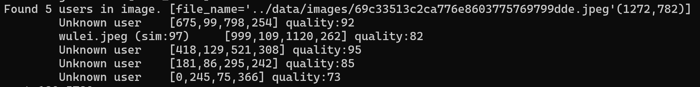
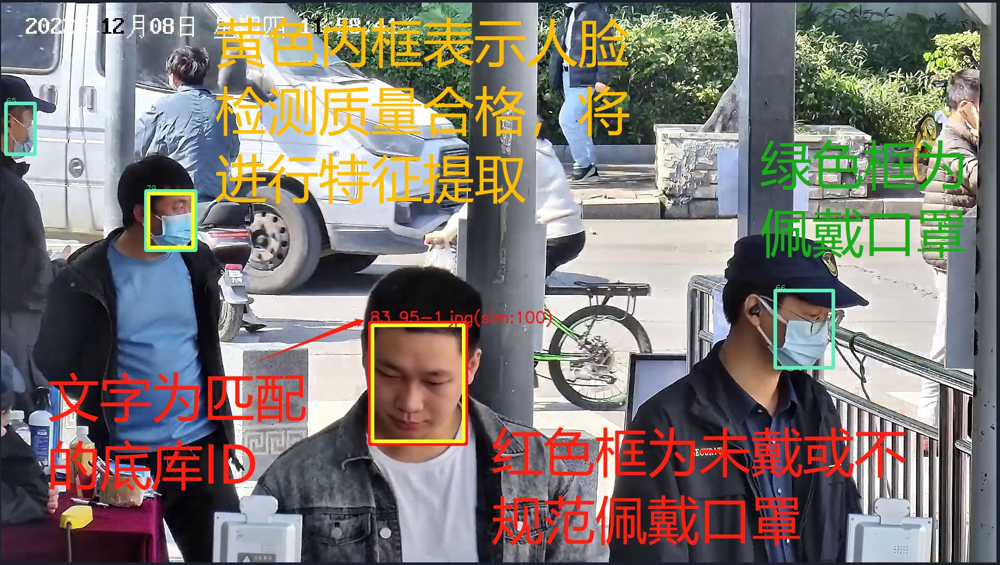

# 人脸识别&车牌识别 SDK 简介

本文说明 人脸 DEMO 的使用。

## 人脸识别 Demo

`face_demo.cpp` 为防疫闸机的 Demo。它实现了从 ../data/users 目录读取图片并作为底库，再从 ../data/images 读取图片进行人脸检索的功能，检测结果将以图片形式输出到 ../data/images_result 目录。

其默认的人脸检测质量阈值为 70 分，人脸相似度匹配阈值为 87 分。Demo 的命令行输出包含每张图片的人俩检测结果和匹配结果，如下图所示：

其同时输出图像结果，同样标注了人脸检测信息和人脸匹配的结果，如下图所示：

为便于统计识别效果，建议在 ../data/users 目录中，以 `{id}_{no}.jpg` 的形式命名用户底图，在 ../data/images 目录中以 `{id}_{no}.jpg` 的形式命名比对图片。Demo 程序将根据 `{id}` 自动统计人脸识别的召回率和准确率，并在命令行中输出。

召回率的计算方式为：所有进行人脸匹配并且命中人脸的图片数量除以图片总数；准确率的计算方式为：匹配正确的人脸数，除以进行人脸匹配且命中人脸的图片数量。
